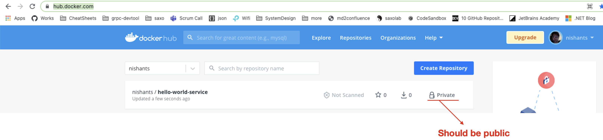
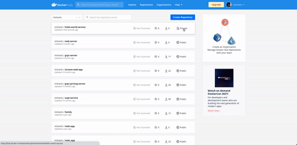

### TODO

- [x] Create a service
- [x] Dockerize service
- [x] Publish image to docker registry
- [x] Create a kubernetes manifest
- [ ] Change tone from you to we
- [x] ~~Create script in poweshell~~
- [ ] Help on creating accounts
  - [ ] Instructions to create docker hub account
  - [ ] Instructions on creating azure account
- [ ] Read more sub documents
  - [ ] Defining a docker file 
    - [ ] layers
    - [ ] base images
    - [ ] stages
  - [ ] Kubernetes configuration
    - [ ] What is a manifest ?
    - [ ] kubernetes apply
    - [ ] Pod
    - [ ] Service
      - [ ] ingress
    - [ ] Deployment
    - [ ] Load balancer
    - [ ] Replica controller
  - [ ] Docker registry
    - [ ] what is a registry
    - [ ] why we need it 
    - [ ] why we made it public
- [ ] Create sub document to explain in details
  - [ ] creating a docker file
  - [ ] docker registry
  - [ ] kubectl, kuberntes, aks, pods, services, load balancer,


# Your first DotNet Service on AKS

This article will help you setup your first service on AKS. It does not intend to provide an in-depth knowledge on the tech-stack. Idea is, that once you have it working you can play around, experiment, explore and enhance to learn the concepts in depth or to create a prototype.

We will create a simple service and talk about basics of docker and kubernetes. You need ***no prior experience with Docker/Kubernetes or Azure for this.***

In this article we focus on just creating a simple web service. There is another article that demonstrates creating a streaming server with gRPC and websockets here https://github.com/dotnet-school/dotnet-streaming-aks.


### Pre-requisite

- **Development environment**

  > If you are using you office laptop, you can have problems because of firewall and network policies.
  >
  > It is recommended that you use your personal machine so that you can freely communicate with docker hub and azure.

- **.NET 5 SDK**

  > We will use .NET5 boileplates to create a sample service which we will run on AKS.
  >
  > Download and install from  https://dotnet.microsoft.com/download/dotnet/5.0

- **Docker Desktop** 

  > To build and publish images to docker repository. 
  >
  > Download and install from https://www.docker.com/products/docker-desktop.

- **Docker Hub Acccount**

  > For this tutorial we will use Docker Hub as our Docker registry. You can use anything else like Azure Container Registry, but its recommended to use docker hub to help you follow along the steps in this article.
  >
  > Create your account here : https://hub.docker.com/signup

- **Kubectl**

  > To run command against kubernetes cluster on AKS.
  >
  > Download and install from : https://kubernetes.io/docs/tasks/tools/

- **Azure Portal Account**

  > Signup to create you azure account here https://signup.azure.com/signup

- **Azure CLI**

  > To be able to connect to Azure via cli. You can skip this and use Azure cloud shell instead. But is recommended to help you follow along the steps in this article.
  >
  > Download and install from https://docs.microsoft.com/en-us/cli/azure/install-azure-cli
  
- **CLI**

  > Commands in this arcticle are created for bash. You can use most command in a poweshell. Its recommended to use something like `wsl` or `git bash` if you are running on windows.
  >
  > Download and install gitbash (if required) from : https://git-scm.com/downloads

 

# Steps

- [***Create your service***](#create-first-service)

  > Use `dotnet5` boilerplate to create a service. 
  
- ***[Create a Dockerfile](#run-as-docker-container)***

  > Create a `Dockerfile` for your service

- ***[Publish Service on Docker Registry](#publish-to-docker-registry )***

  > Publish the image on docker registry so that it can be downloaded inside Azure Kubertes cluster.
  
- ***[Create Kubernetes Manifest](#create-kubernetes-manifest)***

  > Create a `.yaml` file to define how to run service in a kubenetes cluster

- ***[Deploy to AKS](#deploy-to-aks)***

  > Create a cluster on AKS, and use our manifest file with kubectl to deploy our serivce to Azure Kubernetes Service.


<a name="create-first-service"></a>

# Create a service

You can create the service using visual studio. Please ensure you keep the folder strucutre as below : 

- <repository>
  - HelloWorldService
    - HelloWorldService.csproj
    
    

For this article we will use the CLI to create a new service.

```bash
# Create a directory for the project
mkdir dotnet-first-aks-service
  
# Initialize a git repo
git init

# Create a .gitignore file
dotnet new gitignore
  
# Create a web api .net5 using boileplate
dotnet new webapi -o HelloWorldService

# Run your service 
dotnet run --project HelloWorldService/HelloWorldService.csproj
```


Now open url http://localhost:5000/WeatherForecast in browser to ensure our service is up and running.


<a name="run-as-docker-container"></a>

# Create a Dockerfile

In Kubernetes world (or cloud native world in general) everything runs as a container. Be it the database, messaging broker, in-memory caches e.t.c.

A dockerfile describes how to run a program as a docker container.

Create a file `dotnet-first-aks-service/HelloWorldService/Dockerfile` as follows : 

```dockerfile
# HelloWorldService/Dockerfile

FROM mcr.microsoft.com/dotnet/core/sdk:3.1 AS build
WORKDIR /source

COPY ./*.csproj .
RUN dotnet restore

COPY . .
RUN dotnet publish -c release -o /app --no-restore

FROM mcr.microsoft.com/dotnet/core/aspnet:3.1
WORKDIR /app

COPY --from=build /app .

EXPOSE 80  
ENTRYPOINT ["dotnet", "HelloWorldService.dll"]
```


Create another file `dotnet-first-aks-service/HelloWorldService/.dockerignore` as follows : 

```powershell
**/.dockerignore
**/.project
**/.vs
**/.idea
**/.vscode
**/*.*proj.user
**/bin
**/Dockerfile*
**/obj
```


Build and run you docker file

```bash
# To to folder containing the Dockerfile
cd HelloWorldService
 
# Create docker image
docker build -t hello-world-service .

# Run service as a Docker container
docker run -p 5000:80 hello-world-service
```

Now open url http://localhost:5000/WeatherForecast  in browser to ensure our service is running as a docker container.

[Read more about docker here](./docs/Docker.md)

<a name="publish-to-docker-registry"></a>

# Publish Service on Docker Registry

```bash
# Log into you docker account
docker login

# Create you image name on docker registry
docker tag hello-world-service <your-docker-hub-username>/hello-world-service:v1

# e.g.
# docker tag hello-world-service nishants/hello-world-service:v1

# Push your image to docker registry
docker push <your-docker-hub-username>/hello-world-service:v1

# outptu : 
# The push refers to repository [docker.io/<your-docker-hub-username>/hello-world-service]
```


<your-docker-hub-username>

By default, the image is marked as private. We don't want to setup authentication in AKS. So, to keep it simple, we will marke the image as public, available for anyone to use.




**Steps to make your image public:** 




<a name="create-kubernetes-manifest"></a>

# Create Kubernetes Manifest

Create a file `Kubernetes/hello-world-service.yml`to define manifest (say kubernetes configuration) for the service as follows : 

```yaml
# Kubernetes/hello-world-service.yml

# This part creates a load balancer pod that receives traffic from internet and load-balances to different instances of our service
apiVersion: v1
kind: Service
metadata:
  name: hello-world-service
spec:
  selector:
    app: hello-world     # This makes load balancer point to hello-world deployment
  ports:
    - port: 80
      targetPort: 80  # The port our container(in pods) listens to
  type: LoadBalancer
---


# This part creates defines which docker image to use for creating instances of our service and how many instances to create
apiVersion: apps/v1
kind: Deployment
metadata:
  name: hello-world
spec:
  
  replicas: 2   # Run two instances of our service
  selector:
    matchLabels:
      app: hello-world
  template:
    metadata:
      labels:
        app: hello-world
    spec:
      containers:
        - name: hello-world
          image: docker.io/nishants/hello-world-service:v1  # Our docker image on docker hub
          ports:
            - containerPort: 80           # Port that our app listens to
          imagePullPolicy: Always
```


<a name="deploy-to-aks"></a>

# Deploy to Auzure Kubernetes Service

```bash
# login using azure cli
az login

RESOURCE_GROUP=dotnet-first-aks-service
CLUSTER_NAME=dotnet-first-aks-service-cluster
REGION=westeurope

  # Create resource
az group create --name $RESOURCE_GROUP --location $REGION

  # Create cluster on AKS with 1 node
az aks create --resource-group $RESOURCE_GROUP \
--name $CLUSTER_NAME \
--node-count 1 \
--enable-addons monitoring \
--generate-ssh-keys

  # Allow kubectl to connect and manage our AKS clustuer
az aks get-credentials \
--resource-group $RESOURCE_GROUP \
--name $CLUSTER_NAME

  # Check if our node is up and running
kubectl get nodes
  # NAME                                STATUS   ROLES   AGE     VERSION
  # aks-nodepool1-36600731-vmss000000   Ready    agent   2m58s   v1.17.10

  # Deploy our app 
kubectl apply -f Kubernetes/

# View the external ip address of our service
kubectl get service/hello-world-service
# NAME                     TYPE           CLUSTER-IP     EXTERNAL-IP     
# hello-world-service   LoadBalancer   10.0.105.141   51.105.150.87   
```


Remember to delete your Azure resources when you are done

```bash
az group delete --name $RESOURCE_GROUP --yes --no-wait
```

