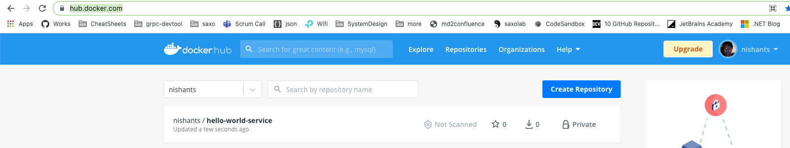

### TODO

- [x] Create a service
- [x] Dockerize service
- [ ] 
- [ ] Publish image to docker registry
- [ ] Create a kubernetes manifest
- [ ] Help on creating accounts
  - [ ] Instructions to create docker hub account
  - [ ] Instructions on creating azure account
- [ ] Create sub document to explain in details
  - [ ] creating a docker file
  - [ ] docker registry
  - [ ] kubectl, kuberntes, aks, pods, services, load balancer,


# Your first DotNet Service on AKS

This article will help you setup your first service on AKS. It does not intend to provide an in-depth knowledge on the tech-stack. Idea is, that once you have it working you can play around, experiment, eplore and enhance to learn the concepts in depth or to create a prototype.


We will create a simple service and talk about basics of docker and kubernetes. You need no prior experience with Docker/Kubernetes or Azure for this.


In this article we focus on just creating a simple web service. There is another article that demonstrates creating a streaming server with gRPC and Websockets here https://github.com/dotnet-school/dotnet-streaming-aks.


### Pre-requisite

- **.NET 5 SDK**

  > We will use .NET5 boileplates to create a sample service which we will run on AKS.
  >
  > Download and install from  https://dotnet.microsoft.com/download/dotnet/5.0

- **Docker Desktop** 

  > To build and publish images to docker repository. 
  >
  > Download and install from https://www.docker.com/products/docker-desktop.

- **Docker Hub Acccount**

  > For this tutorial we will use Docker Hub as our Docker registry. You can use anything else like Azure Container Registry, but its recommended to use docker hub to help you follow along the steps in this article.
  >
  > Create your account here : https://hub.docker.com/signup

- **Kubectl**

  > To run command against kubernetes cluster on AKS.
  >
  > Download and install from : https://kubernetes.io/docs/tasks/tools/

- **Azure Portal Account**

  > Signup to create you azure account here https://signup.azure.com/signup

- **Azure CLI**

  > To be able to connect to azure via cli. You can skip this and use Azure cloud shell instead. But is recommended to help you follow along the steps in this article.
  >
  > Download and install from https://docs.microsoft.com/en-us/cli/azure/install-azure-cli


### Steps

- [***Create your service***](#create-first-service)

  > Use `dotnet5` boilerplate to create a service. 
  
- ***[Create a Dockerfile](#run-as-docker-container)***

  > Create a `Dockerfile` for your service

- ***[Publish Service on Docker Registry](#publish-to-docker-registry )***

  > Publish the image on docker registry so that it can be downloaded inside Azure Kubertes cluster.


<a name="create-first-service"></a>

### Create a service with .net5

You can create the service using visual studio. Please ensure you keep the folder strucutre as below : 

- <repository>
  - HelloWorldService
    - HelloWorldService.csproj
    
    

For this article we will use the CLI to create a new service.

```bash
# Create a directory for the project
mkdir dotnet-first-aks-service
  
# Initialize a git repo
git init

# Create a .gitignore file
dotnet new gitignore
  
# Create a web api .net5 using boileplate
dotnet new webapi -o HelloWorldService

# Run your service 
dotnet run --project HelloWorldService/HelloWorldService.csproj
```


Now open url http://localhost:5000/WeatherForecast in browser to ensure our service is up and running.


<a name="run-as-docker-container"></a>

### Create a Dockerfile

In Kubernetes world (or cloud native world in general) everything runs as a container. Be it the database, messaging broker, in-memory caches e.t.c.

A dockerfile describes how to run a program as a docker container.

Create a file `dotnet-first-aks-service/HelloWorldService/Dockerfile` as follows : 

```dockerfile
# HelloWorldService/Dockerfile

FROM mcr.microsoft.com/dotnet/core/sdk:3.1 AS build
WORKDIR /source

COPY ./*.csproj .
RUN dotnet restore

COPY . .
RUN dotnet publish -c release -o /app --no-restore

FROM mcr.microsoft.com/dotnet/core/aspnet:3.1
WORKDIR /app

COPY --from=build /app .

EXPOSE 80  
ENTRYPOINT ["dotnet", "HelloWorldService.dll"]
```


Create another file `dotnet-first-aks-service/HelloWorldService/.dockerignore` as follows : 

```powershell
**/.dockerignore
**/.project
**/.vs
**/.idea
**/.vscode
**/*.*proj.user
**/bin
**/Dockerfile*
**/obj
```


Build and run you docker file

```bash
# To to folder containing the Dockerfile
cd HelloWorldService
 
# Create docker image
docker build -t hello-world-service .

# Run service as a Docker container
docker run -p 5000:80 hello-world-service
```

Now open url http://localhost:5000/WeatherForecast  in browser to ensure our service is running as a docker container.


<a name="publish-to-docker-registry"></a>

### Publish Service on Docker Registry

```bash
# Log into you docker account
docker login

# Create you image name on docker registry
docker tag hello-world-service <your-docker-hub-username>/hello-world-service:v1

# e.g.
# docker tag hello-world-service nishants/hello-world-service:v1

# Push your image to docker registry
docker push <your-docker-hub-username>/hello-world-service:v1

# outptu : 
# The push refers to repository [docker.io/<your-docker-hub-username>/hello-world-service]
```


<your-docker-hub-username>

By default, the image is marked as private. We don't want to setup authentication in AKS. So, to keep it simple, we will marke the image as public, available for anyone to use.




**Steps to make your image public:** 

<iframe width="560" height="315" src="https://www.youtube.com/embed/isYt_kGNjIY" title="YouTube video player" frameborder="0" allow="accelerometer; autoplay; clipboard-write; encrypted-media; gyroscope; picture-in-picture" allowfullscreen></iframe>


https://user-images.githubusercontent.com/58986949/115314310-805b2780-a1a7-11eb-8558-648a367ea231.mp4

./docs/videos/make-docker-image-public.mov

[video](./docs/videos/make-docker-image-public.mov)


docs/videos/make-docker-image-public.mov

[video](docs/videos/make-docker-image-public.mov)


Iframe

<video width="320" height="240" controls>   <source src="docs/videos/make-docker-image-public.mov" type="video/mp4">   <source src="docs/videos/make-docker-image-public.mov" type="video/ogg"> Your browser does not support the video tag. </video>

  
  
 Github raw url
  https://github.com/dotnet-school/dotnet-first-aks-service/raw/master/docs/videos/make-docker-image-public.mov
