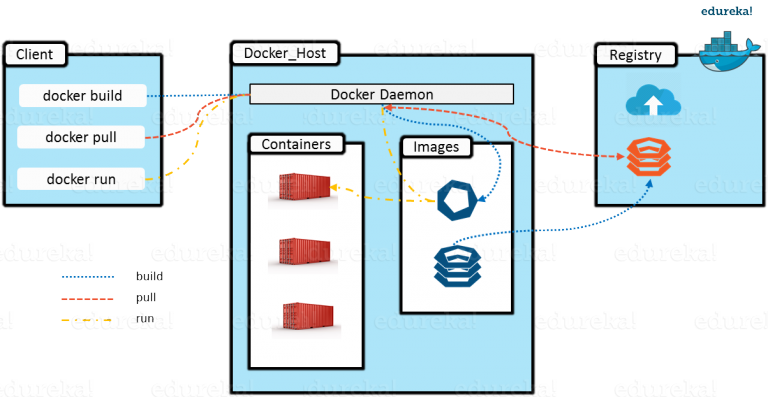

# Quick Intro to Docker


**Images**

- An image is a portable **exectable package** (just like of a binary)

- Defined using a **Dockerfile** (with build command)

- It includes everything to run an application 
  - runtime
  - code
  - configuration and env variables
  - libraries

- Defines what the container will be like when launched at runtime


**Container**

- Container is runtime instance of an image
- i.e. it is an image with state or process
- view all running containers on a machine using ```docker ps```


**Docker Deamon (Your Docker Desktop)**

- Manages all docker operations : 
  - **download images** from registry
  - **launch images as containers**
  - **push images** to repository 
  - etc
- **Inovked via HTTP calls**
- docker **cli makes HTTP calls to docker daemon** running locally 
- Also daemon can be running remotely and docker cli can talk to it via http


 


# Using Docker for Development

```bash
# Run MS-SQL
docker run -e 'ACCEPT_EULA=Y' -e 'SA_PASSWORD=yourStrong(!)Password' -p 1433:1433 -d mcr.microsoft.com/mssql/server:2017-CU8-ubuntu

# Run Redis 
docker run -p 6379:6379 -e ALLOW_EMPTY_PASSWORD=yes bitnami/redis
  
# Run OAPI Prices service with Redis, NATS, Streaming service, PaaS gRPC Server on local machine
docker-compose up
```


# Creating Dockerfile

The most trivial Dockerfile for our service could have been like below : 

```dockerfile
# This base image has .NET SDK and Runtime installed
FROM mcr.microsoft.com/dotnet/sdk:5.0 AS build

# Create a source folder and copy our source code into it
WORKDIR /source
COPY . .

# Build and run our service
RUN dotnet publish -c release -o /app
ENTRYPOINT ["dotnet", "run", "/app/HelloWorldService.dll"]  
```


Now we will look at a couple of optimizations that we can do on the above definition and learn about two key concepts in docker.


### Layers 

Every docker image is composed of several layers. Each instruction you see in dockerfile will create a new layer.

When we build the docker file, it takes time for Docker daemon to create a layer. To improve build times, it only create layer if it needs to be changed.

For e.g. in the above Dockerfile, everytime we change a line in source code, the image created by `COPY . .` will change and hence the nugets will be downloaded and installed inside the Dockerfile.

To fix this we will copy csproj, restore nuget and then try to build our project : 

```Dockerfile
FROM mcr.microsoft.com/dotnet/sdk:5.0 AS build
WORKDIR /source

COPY ./*.csproj .
RUN dotnet restore

# Now if source code changes, the layes above will not change
# hence docker build will run much faster on chaning source code
COPY . .
RUN dotnet publish -c release -o /app --no-restore

RUN dotnet dev-certs https -t
ENTRYPOINT ["dotnet", "run", "/app/HelloWorldService.dll"]  
```


### Stages

In the above docker file our base image contains .NET SDK as well as Runtime. It needs SDK to compile our code. Once we publish our image to docker, the sdk and related libraries are published along with our code. This results in a larger dockerfile and larger data transfers everytime we upload/download the image.

To handle such scenarios, we can use a multi-stage docker build. We can throw away the sdk once the code is compiled and keep only runtime dependencies in our image.

```dockerfile
# Use SDK image for compilation
FROM mcr.microsoft.com/dotnet/sdk:5.0 AS build
WORKDIR /source

COPY ./*.csproj .
RUN dotnet restore

COPY . .
RUN dotnet publish -c release -o /app --no-restore

# Discard the sdk and package only the runtime dependencies in final image
FROM mcr.microsoft.com/dotnet/aspnet:5.0
WORKDIR /app

COPY --from=build /app .

EXPOSE 80  
ENTRYPOINT ["dotnet", "HelloWorldService.dll"]
```

