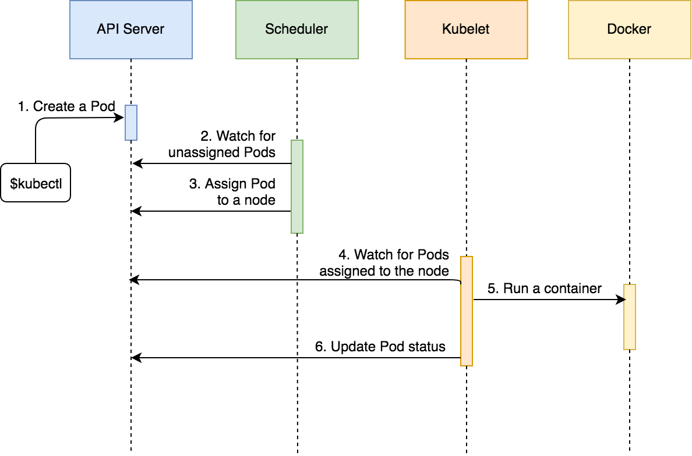

## Pod

- smallest unit in kubernetes
- runs one or more containers
- unique ip adress
- mount volumes
- define how container runs (just like docker compose)
- can use any typeof containers (Docker, rkt)
- **Are designed to run multiple containers in cohesion** 
- **All containers in a pod can communicate with each other using localhost.**
- **We do not create pods direcly**, usually we create Deployment that creates replica sets which in turn creates the pods


### Sampel pod definitions

```yaml
apiVersion: v1
kind: Pod
metadata:
  name: go-demo-2
  labels:
    type: stack
spec:
  containers:
  - name: db
    image: mongo:3.3
  - name: api
    image: vfarcic/go-demo-2
    env:
    - name: DB
      value: localhost
```


### Setup

- Create minikube, connect with kubect and checkout code

  ```bash
  minikube start --vm-driver=virtualbox
  kubectl get nodes
  cd k8s-specs
  kubectl create -f pod/db.yml
  
  kubectl get pods -o wide
  # NAME   READY   STATUS    RESTARTS   AGE     IP           NODE       NOMINATED NODE   READINESS GATES
  # db     1/1     Running   0          6m48s   172.17.0.4   minikube   <none>           <none>
  ```

- What happens when we run the kubectl create command : 

  - kubectl sends HTTP request to API server, which saves the pod definition

  - Scheduler which is watching unassigned pods, detects this

  - Scheduler finds the right node for the pod and sends to API server

  - Kubelet on the pod listens to the unassigned Pod and detects assigned Pod

  - Kubelet downloads the Pod definition and runs the containers on the node based on specs

  - Kubelet sends message to API server about creation of the Pod.

    

  

  


### Events of Pod setup

- To check what happened on pod setup, we can run command describe and look at events

  ```bash
  kubectl describe pod db
  # ........[irrelevant]
  #  Type    Reason     Age   From               Message
  #  ----    ------     ----  ----               -------
  #  Normal  Scheduled  31m   default-scheduler  Successfully assigned default/db to minikube
  #  Normal  Pulled     31m   kubelet, minikube  Container image "mongo:3.3" already present on machine
  #  Normal  Created    31m   kubelet, minikube  Created container db
  #  Normal  Started    31m   kubelet, minikube  Started container db
  ```

- As we see in above, a total of four events happened

  - schedular assigned pod to the `minikube` node (we have just one node called minikube)
  - kubelet then detects and pulls the image, creates the pod and updates when pod is ready


### Communicating with a Pod

- Use the exec command 

  ```bash
  kubectl exec -it db -- sh # Run shell with stdin -i and output to terminal -t
  kubectl exec -t -c <container-name> db --sh # if mulitple containers running, else first is default
  ```


### Delete Pod event

- To delete pod,

  ```
  kubectl delete pod db
  ```

- Steps

  - kubectl sends the `TERM` (terminate ) signal to the containers of the pod
  - then it waits for `gracePeriodSeconds` (deafult 30 seconds) till the container is shut down gracefully
  - after the grace period is expired, sends signal `KILL` to the container to kills forcefully

- **Grace Period**

  - default is 30 seconds
  - can be specified by `gracePeriodSeconds` in YAML or `--grace-period` flag in command


### Health Checks (probes)
- Two types

  - **liveness probe (pods)**
  - **readiness probe (services)**

- Defining a liveness probe for  a Pod

  ```yaml
  apiVersion: v1
  kind: Pod
  metadata:
    name: go-demo-2
    labels:
      type: stack
  spec:
    containers:
    - name: api
      image: vfarcic/go-demo-2
      env:
      - name: DB
        value: localhost
      livenessProbe:          #### Liveness probe ####
        httpGet:              # Health check url and port
          path: /this/path/does/not/exist  
          port: 8080
        initialDelaySeconds: 5 # Wait this amount of times after running the Pod
        timeoutSeconds: 2 		 # Request time out delay (Defaults to 1)
        periodSeconds: 5 			 # Retry delay (Defaults to 10)
        failureThreshold: 1 	 # Number of attempts (Defaults to 3)
  ```

  
