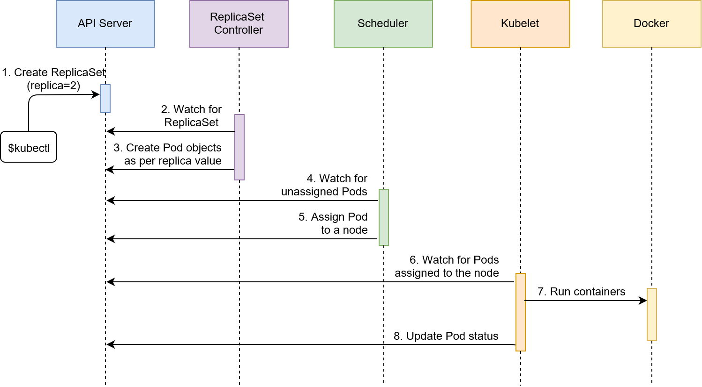

# Replica Sets

- Makes sure specified number of pod replicas are always running
- It is a type of **Controller**
- Pods when destroyed, do not launch  themselves up again (unless used with a controller)
- Self heals Pods in a cluster


### Defining a ReplicaSet

- We can defined replica sets as : 

  ```yaml
  apiVersion: apps/v1
  kind: ReplicaSet
  metadata:
    name: go-demo-2
  spec:
    replicas: 2     # Default value is 1
    selector:
      matchLabels:
        type: backend
        service: go-demo-2
    template:
      metadata:
        labels:
          type: backend
          service: go-demo-2
          language: go
      spec:
        containers:
        - name: db
          image: mongo:3.3
          livenessProbe:
            httpGet:
              path: /demo/hello
              port: 8080
  ```

- If Pods with matching selectors already exists, it does nothing

  ```bash
  # Create the replica sets
  kubectl create -f rs/go-demo-2.yml
  
  # Check pods
  ```


### Sequence of events

- kubectl sends request to create replica sets

- replication controllers is watching for creationg of replica sets detects events

- replication controller creates two unassigned pods

- scheduler detects unassigned pods

- scheduler finds nodes and assigns them to the pods

- kubelet detect newly assigned pods to their respective nodes

- kubelet download the  pod definition, download and run containers and update api server of creation/readiness of pod

  

Deleting ReplicaSet

- to delete replica set withoug deleting the pods, use `--cascade=false`

  ```bash
  # Retain pods, delete replica set only
  kubectl delete -f rs/go-demo-2.yml --cascade=false
  ```

  

### Deployment vs Replica Sets

- Deployment create replica sets internally
- But deploymnet also provide feature of rolling updates (replica sets do not)

- So `Deployment creates Replica Sets` -> `Replica sets creates pods`. We usually do not create pods and replica sets ourselves.


### Selectors and ReplicaSets

- ReplicaSets identify the containers using the matchLabel field.

- So if the label of a pod is removed, ReplicaSet will consider it deleted and create another one 

- If the label is added back, it will identify there are more number of pods running that specified, so will terminate of of them

  


