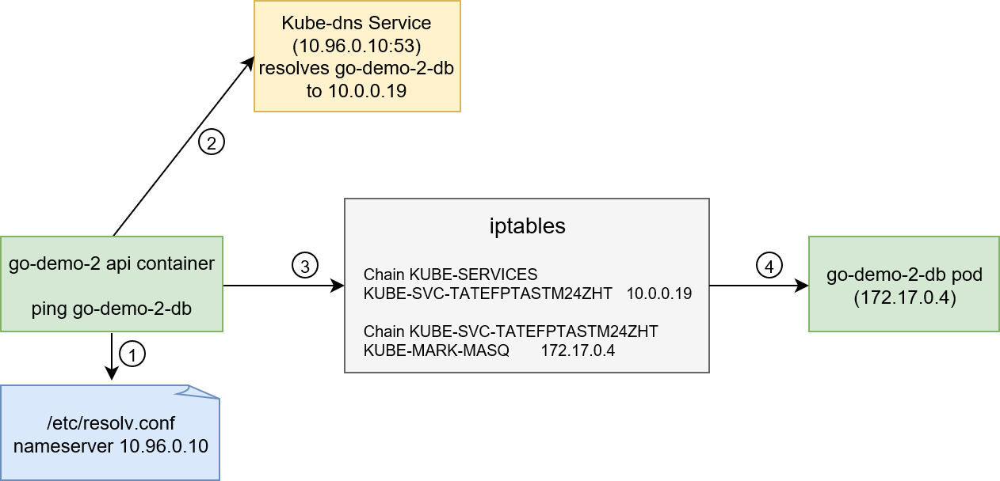

# Services

- Pods are ephermal

- So we cannot directly talk to a pod as it might just die while wer are still talking to it

- So services act as load balancer in front of a pod

- Make sure the requests go to  a healthy pod

- example: 

  ```yaml
  apiVersion: v1
  kind: Service
  metadata:
    name: todo-app-service
  spec:
    selector:
      app: todo-app     # This makes load balancer point to todo-app deployment
    ports:
      - port: 80        
        targetPort: 80  # The port our container(in pods) listens to
    type: LoadBalancer  # Type of service (NodePort | ClusterIp | ExtrernalName | LoadBalancer)
  ```

- Lets run a replica set (not service)

  ```bash
  kubectl create -f svc/go-demo-2-rs.yml
  ```

- now we can expose a replica set (or a pod) using the expose command as below :

  ```bash
  kubectl expose rs go-demo-2 \  # The object we are exposing with new service
      --name=go-demo-2-svc    \  # Name of Service
      --target-port=28017     \  # Target pod port
      --type=NodePort            # Type of service (NodePort can listen on external traffic)
  ```


Types of services : 

- **ClusterIP** :  for routing internal traffic only
- **NodePort** : for listening to external traffic. Automatically creates ClusterIP
- **LoadBalancer**: can be combined with a provider's load balancer
- **ExternalName** : can be bound with external DNS name


### Steps in service creation 

- **kubectl** sends APIServer request to create new service difinition

- **Endpoint Controller** : detects new service and creates and endpoint object

- **Kube Proxy** : detects new endpoint object and update IP table rules

- **Kube DNS** : dectets new service and updates the DNS 

  


### Readiness vs Liveness Probe

- `livenessProbe` : when to replace the pod

- `readinessProbe` : when to begin routing traffic to the pod

  ```yaml
  apiVersion: apps/v1
  kind: ReplicaSet
  metadata:
    name: go-demo-2-api
  spec:
    replicas: 3
    selector:
      matchLabels:
        type: api
        service: go-demo-2
    template:
      metadata:
        labels:
          type: api
          service: go-demo-2
          language: go
      spec:
        containers:
        - name: api
          image: vfarcic/go-demo-2
          env:
          - name: DB
            value: go-demo-2-db
          readinessProbe:
            httpGet:
              path: /demo/hello
              port: 8080
            periodSeconds: 1
          livenessProbe:
            httpGet:
              path: /demo/hello
              port: 8080
  ```


- Describing a service : 

  ```yaml
  # kubectl describe svc go-demo-2-svc
  Name:                    go-demo-2-svc
  Namespace:               default
  Labels:                  db=mongo
                           language=go
                           service=go-demo-2
                           type=backend
  Annotations:             <none>
  Selector:                service=go-demo-2,type=backend
  Type:                    NodePort
  IP:                      10.0.0.194                         # IP to access service (iptable)
  Port:                    <unset>  28017/TCP
  TargetPort:              28017/TCP                          # Target port of the containers
  NodePort:                 <unset>  31879/TCP                # The port that service listens to
  Endpoints:               172.17.0.4:28017,172.17.0.5:28017  # IP of pods selectors
  Session Affinity:        None
  External Traffic Policy: Cluster
  Events:                  <none>
  ```

  

- Describing an endpoint : 

  ```yaml
  # kubectl get ep go-demo-2 -o yaml
  apiVersion: v1
  kind: Endpoints
  metadata:
    creationTimestamp: 2017-12-12T16:00:51Z
    name: go-demo-2
    namespace: default
    resourceVersion: "5196"
    selfLink: /api/v1/namespaces/default/endpoints/go-demo-2
    uid: a028b9a7-df55-11e7-a8ef-080027d94e34
  subsets:
  - addresses:
    - ip: 172.17.0.4                # Ip of the pod running container
      nodeName: minikube            # Name of node of the pod
      targetRef:
        kind: Pod
        name: go-demo-2-j8kdw
        namespace: default
        resourceVersion: "5194"
        uid: ac70f868-df4d-11e7-a8ef-080027d94e34
    - ip: 172.17.0.5								# Ip of the pod running container
      nodeName: minikube            # Name of node of the pod
      targetRef:
        kind: Pod
        name: go-demo-2-5vlcc
        namespace: default
        resourceVersion: "5184"
        uid: ac7214d9-df4d-11e7-a8ef-080027d94e34
    ports:
    - port: 28017									  # entpoint port
      protocol: TCP
  ```

  


### Services discovery

- Two ways of discovering a serice

  - DNS (by service name as host)
  - ENV (all pods get all services in env variables)

- Every pod gets all service details in env variables, e.g. (https://www.educative.io/courses/practical-guide-to-kubernetes/39vvkrY048x)

  ```properties
  #kubectl exec $POD_NAME -- env
  GO_DEMO_2_DB_PORT=tcp://10.0.0.250:27017
  GO_DEMO_2_DB_PORT_27017_TCP_ADDR=10.0.0.250
  GO_DEMO_2_DB_PORT_27017_TCP_PROTO=tcp
  GO_DEMO_2_DB_PORT_27017_TCP_PORT=27017
  GO_DEMO_2_DB_PORT_27017_TCP=tcp://10.0.0.250:27017
  GO_DEMO_2_DB_SERVICE_HOST=10.0.0.250
  GO_DEMO_2_DB_SERVICE_PORT=27017
  ```

- Process of steps involved in services discovery

  - pod makes call to a serivce by its name

  - the DNS server is searched in the `/etc/resolv.conf` file.

  - kubelet added the kubedns in `etc/resolv.conf` when creating the pod

  - request to to DNS server to resolve teh serfvice host name

  - DNS server was updated by kube-dns when the service was created

  - DNS server returns the ip address of the service

  - using iptables, the request is routed to one of endpoint mapped to service.

    

